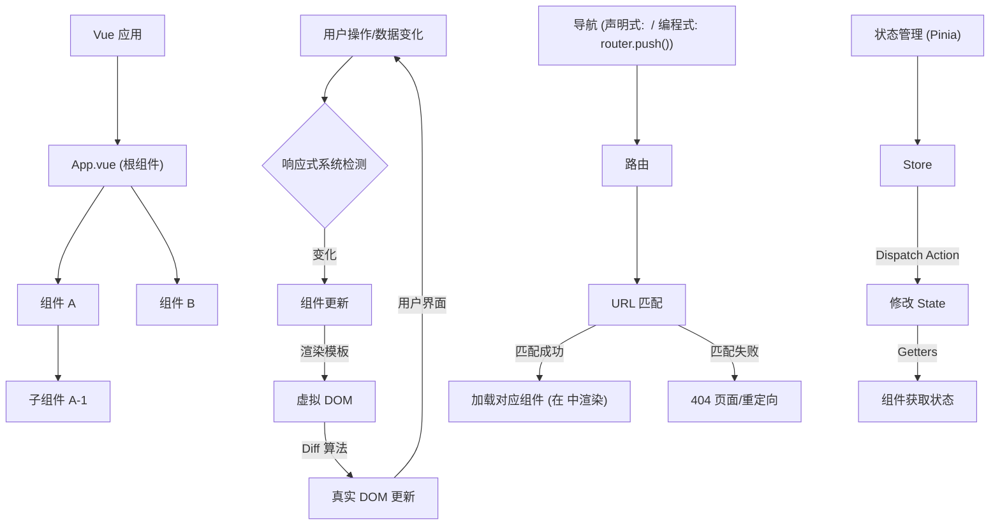

# Vue 3 框架的逻辑 (详细版)

Vue 3 作为一个渐进式 JavaScript 框架，用于构建用户界面。它在 Vue 2 的基础上进行了许多改进，提供了更好的性能、更小的包体积和更友好的开发体验。

## 核心概念

### 1. 组件 (Components)
*   **定义**: Vue 应用由一系列可复用的组件构成，每个组件都包含自己的模板 (Template)、脚本 (Script) 和样式 (Style)。组件化是 Vue 的核心思想，它使得应用结构清晰，易于维护和扩展。
*   **组合式 API (Composition API)**: Vue 3 推出的新特性，用于更灵活地组织组件逻辑。它允许开发者根据功能将逻辑代码组织在一起，而不是根据选项 (data, methods, computed 等)。
    *   `setup()` 函数: 组件的入口点，在组件实例创建之前执行，用于设置响应式状态、计算属性、方法和生命周期钩子。它接收 `props` 和 `context` (包含 `attrs`, `slots`, `emit`) 作为参数。
    *   `ref()`: 用于创建响应式基本类型数据 (如字符串、数字、布尔值)。访问其值时需要使用 `.value`。
    *   `reactive()`: 用于创建响应式对象或数组。它会深度劫持对象的所有属性。
    *   `computed()`: 用于创建计算属性，其值依赖于其他响应式数据。只有当其依赖项发生变化时，才会重新计算。可以传入一个 getter 函数，或者一个包含 `get` 和 `set` 的对象。
    *   `watch()` 和 `watchEffect()`: 用于监听响应式数据的变化并执行副作用。
        *   `watch()`: 明确指定要监听的数据源和回调函数。可以监听单个 `ref`、`reactive` 对象、getter 函数或一个数组。
        *   `watchEffect()`: 自动追踪其内部访问的响应式依赖，并在依赖变化时重新运行。
*   **选项式 API (Options API)**: 兼容 Vue 2 的写法，通过 `data`, `methods`, `computed`, `watch`, `lifecycle hooks` 等选项来组织组件逻辑。适用于小型组件或习惯 Vue 2 的开发者。例如：
    ```javascript
    export default {
      data() {
        return {
          message: 'Hello Vue!',
        };
      },
      methods: {
        greet() {
          alert(this.message);
        },
      },
      // ...
    };
    ```

### 2. 响应式系统 (Reactivity System)
*   **原理**: Vue 3 使用 `Proxy` 对象重写了响应式系统，相比 Vue 2 的 `Object.defineProperty`，它能更好地追踪对象属性的添加和删除，以及数组索引的变化。
*   **效果**: 当响应式数据发生变化时，相关的视图会自动更新，无需手动操作 DOM。这是 Vue “数据驱动视图”的核心。

### 3. 模板语法 (Template Syntax)
*   **指令 (Directives)**: 特殊的带有 `v-` 前缀的属性，用于在 DOM 上应用特殊的响应式行为。
    *   `v-bind` (缩写为 `:`)：用于属性绑定，将数据绑定到 HTML 元素的属性上，如 ``。
    *   `v-on` (缩写为 `@`)：用于事件监听，监听 DOM 事件并在触发时执行 JavaScript，如 `<button @click="handleClick">`。
    *   `v-if` / `v-else-if` / `v-else`：用于条件渲染，根据条件销毁或重新创建元素。
    *   `v-show`：也是条件渲染，但通过 CSS 的 `display` 属性切换元素的可见性，元素始终存在于 DOM 中。
    *   `v-for`：用于列表渲染，遍历数组或对象来渲染一组元素，如 `<li v-for="item in items" :key="item.id">{{ item.name }}</li>`。
    *   `v-model`：用于表单输入和应用状态之间的双向绑定。
*   **插值 (Interpolation)**: 使用 `{{ }}` 将响应式数据渲染到模板中，如 `<div>{{ message }}</div>`。

### 4. 路由 (Routing) - Vue Router (如何跳转到各个界面)
*   **Vue Router**: 官方的路由管理器，用于构建单页面应用 (SPA)。它允许我们将应用的 URL 映射到对应的 Vue 组件，从而实现页面之间的导航而无需浏览器刷新。
*   **安装**: `npm install vue-router@4` (Vue 3 对应 Vue Router 4)。
*   **配置**:
    * 创建路由实例：在 `src/router/index.js` (或类似文件) 中定义路由规则。
        ```javascript
        *   import { createRouter, createWebHistory } from 'vue-router';
            import Home from '../views/Home.vue';
            import About from '../views/About.vue';
            import PurchaseRequestForm from '../views/PurchaseRequestForm.vue'; // 假设的求购表单页面
    
        const routes = [
          {
            path: '/',
            name: 'Home',
            component: Home,
          },
          {
            path: '/about',
            name: 'About',
            component: About,
          },
          {
            path: '/purchase/new', // 求购功能对应的路径
            name: 'PurchaseRequestForm',
            component: PurchaseRequestForm,
          },
          // 更多路由...
        ];
    
        const router = createRouter({
          history: createWebHistory(), // 使用 HTML5 History 模式
          routes,
        });
    
        export default router;
        ```
    
    * 在 `main.js` 中引入并使用路由：
        ```javascript
        import { createApp } from 'vue';
        import App from './App.vue';
    import router from './router'; // 引入路由实例
        createApp(App).use(router).mount('#app');
        ```
    
*   **声明式导航**:
    * 使用 `<router-link>` 组件在模板中创建导航链接。它会被渲染成一个 `<a>` 标签。
    
        ```html
        <template>
          <nav>
            <router-link to="/">首页</router-link> |
            <router-link to="/about">关于</router-link> |
            <router-link to="/purchase/new">发起求购</router-link>
          </nav>
          <router-view></router-view> <!-- 路由匹配到的组件将在这里渲染 -->
        </template>
        ```
    
    *   `to` 属性可以是一个字符串路径，也可以是一个对象 (推荐，可以传递 `name`, `params`, `query`)：
        ```html
        <router-link :to="{ name: 'PurchaseRequestForm', query: { type: 'electronic' } }">发起电子产品求购</router-link>
        ```
*   **编程式导航**:
    * 在组件的 JavaScript 部分，通过 `useRouter` 钩子获取路由实例，然后使用其方法进行导航。
        ```javascript
        *   import { useRouter } from 'vue-router';
    
        export default {
          setup() {
            const router = useRouter();
    
            const goToPurchaseForm = () => {
              router.push('/purchase/new'); // 跳转到求购表单页面
            };
        
            const goToPurchaseFormWithParams = () => {
              router.push({ name: 'PurchaseRequestForm', params: { id: 'someId' } }); // 带参数跳转
            };
        
            const replaceRoute = () => {
              router.replace('/another-page'); // 替换当前路由，不留下历史记录
            };
        
            const goBack = () => {
              router.go(-1); // 返回上一个页面
            };
        
            return {
              goToPurchaseForm,
              goToPurchaseFormWithParams,
              replaceRoute,
              goBack,
            };
        
          },
        };
        ```
    
    
    
    *   常用的导航方法：
        *   `router.push(location)`: 导航到一个新的 URL，并在历史记录中添加一个新条目。
        *   `router.replace(location)`: 导航到一个新的 URL，但不会在历史记录中添加新条目，而是替换当前的记录。
        *   `router.go(n)`: 在历史记录中前进或后退 `n` 步。`n` 为正数表示前进，负数表示后退。
        *   `router.back()`: 等同于 `router.go(-1)`。
        *   `router.forward()`: 等同于 `router.go(1)`。
*   **动态路由匹配**:
    *   定义带有参数的路由：`path: '/users/:id'`
    * 在组件中通过 `useRoute` 钩子获取当前路由信息，包括参数 `route.params`。
        ```javascript
        import { useRoute } from 'vue-router';
    export default {
          setup() {
            const route = useRoute();
            console.log('User ID:', route.params.id);
            return {};
          },
        };
        ```
    
    

### 5. 状态管理 (State Management)
*   **Pinia**: Vue 3 推荐的轻量级状态管理库，旨在提供更简单、类型更安全的状态管理方案。
    *   **Store**: 集中存储应用的状态，并提供修改状态的 actions 和获取状态的 getters。
    * **定义 Store**:
    
        ```javascript
        *   // src/stores/user.js
        import { defineStore } from 'pinia';
        
        export const useUserStore = defineStore('user', {
          state: () => ({
            isAuthenticated: false,
            userInfo: null,
          }),
          getters: {
            isLoggedIn: (state) => state.isAuthenticated,
          },
          actions: {
            login(userData) {
              this.isAuthenticated = true;
              this.userInfo = userData;
            },
            logout() {
              this.isAuthenticated = false;
              this.userInfo = null;
            },
          },
        });
        ```
    
    * **在组件中使用 Store**:

        ```javascript
        import { useUserStore } from '../stores/user';
        export default {
              setup() {
                const userStore = useUserStore();
                const handleLogin = () => {
                  userStore.login({ name: 'Alice', id: 1 });
                };
        
                return {
                  userStore,
                  handleLogin,
                };
        
          },
        };
        ```
    
    
    
*   **Vuex (兼容)**: 虽然 Pinia 是 Vue 3 的首选，但 Vuex 仍然兼容 Vue 3。

### 6. 构建工具 (Build Tools)
*   **Vite**: Vue 3 官方推荐的构建工具，提供了极速的开发服务器和优化的生产构建。
*   **优势**: 基于 ESM 的开发服务器，按需编译，热模块更新 (HMR) 速度快。
*   **Webpack (兼容)**: 仍然可以使用 Webpack 进行项目构建，但 Vite 在开发体验上更具优势。

## 框架流程图 (Mermaid 语法)



----

[1 tool called]

好的，我们按照前端 -> 后端 -> SQL 的顺序，详细讲解“求购功能”的实现。我将把这些内容添加到 `vue3_framework_logic.md` 文件中，作为一个新的章节。

### 2. 求购功能的实现

“求购功能”允许用户发布他们想要购买的物品信息，等待其他用户提供商品。这通常涉及到一个表单用于发布求购，一个列表用于展示所有求购信息，以及一个详情页用于查看单个求购的详细内容。

#### 2.1. 前端实现 (Vue 3)

前端主要负责用户界面 (UI) 的展示、用户交互、数据验证以及与后端 API 的通信。

**2.1.1. 页面结构与路由**

假设我们有以下几个与求购功能相关的页面：

*   **发起求购页面**: `/purchase/new` (用于用户填写求购信息)
*   **求购列表页面**: `/purchase` (展示所有求购信息)
*   **求购详情页面**: `/purchase/:id` (展示单个求购的详细信息)

在 `src/router/index.js` 中配置路由：

```javascript
// ... 其他 import
import PurchaseRequestForm from '../views/PurchaseRequestForm.vue';
import PurchaseRequestList from '../views/PurchaseRequestList.vue';
import PurchaseRequestDetail from '../views/PurchaseRequestDetail.vue';

const routes = [
  // ... 其他路由
  {
    path: '/purchase/new',
    name: 'PurchaseRequestForm',
    component: PurchaseRequestForm,
    meta: { requiresAuth: true } // 可能需要用户登录才能发布求购
  },
  {
    path: '/purchase',
    name: 'PurchaseRequestList',
    component: PurchaseRequestList,
  },
  {
    path: '/purchase/:id',
    name: 'PurchaseRequestDetail',
    component: PurchaseRequestDetail,
    props: true // 允许路由参数作为组件 props 传递
  },
];

// ... createRouter 和 export default router
```

**路由守卫 (Navigation Guards)**:

对于需要用户登录才能访问的页面（如“发起求购”），可以使用路由守卫进行权限控制。

```javascript
// src/router/index.js
router.beforeEach((to, from, next) => {
  const userStore = useUserStore(); // 假设从 Pinia 获取用户状态
  if (to.meta.requiresAuth && !userStore.isLoggedIn) {
    next('/login'); // 未登录则跳转到登录页
  } else {
    next(); // 继续导航
  }
});
```

**2.1.2. 发起求购页面 (`PurchaseRequestForm.vue`)**

*   **UI 组成**:
    *   表单元素：用于输入求购物品名称、描述、期望价格、数量、联系方式等。
    *   文件上传组件：如果允许上传物品图片。
    *   提交按钮。
*   **数据模型 (响应式数据)**:
    ```javascript
    // Composition API
    import { ref } from 'vue';
    import axios from 'axios'; // 用于发送 HTTP 请求
    import { useRouter } from 'vue-router';

    export default {
      setup() {
        const router = useRouter();
        const purchaseRequest = ref({
          title: '',
          description: '',
          expectedPrice: null,
          quantity: 1,
          contactInfo: '',
          images: [], // 存储图片文件或 URL
        });
        const isLoading = ref(false);
        const errorMessage = ref('');

        const handleFileChange = (event) => {
          // 处理文件上传逻辑，将文件添加到 purchaseRequest.value.images
          // 实际项目中可能需要将文件上传到服务器，然后将返回的图片 URL 存储起来
        };

        const submitRequest = async () => {
          isLoading.value = true;
          errorMessage.value = '';
          try {
            // 假设后端 API 为 /api/purchase-requests
            const response = await axios.post('/api/purchase-requests', purchaseRequest.value);
            if (response.data.success) {
              alert('求购信息发布成功！');
              router.push('/purchase'); // 发布成功后跳转到求购列表页
            } else {
              errorMessage.value = response.data.message || '发布失败';
            }
          } catch (error) {
            console.error('Error submitting purchase request:', error);
            errorMessage.value = '网络错误，请稍后再试。';
          } finally {
            isLoading.value = false;
          }
        };

        return {
          purchaseRequest,
          isLoading,
          errorMessage,
          handleFileChange,
          submitRequest,
        };
      },
    };
    ```
*   **表单验证**:
    *   使用 HTML5 的 `required` 属性进行基本验证。
    *   通过 `watch` 监听表单数据变化，并进行更复杂的 JavaScript 验证（例如，期望价格必须是数字）。
    *   可以集成第三方验证库，如 `VeeValidate` 或 `Vuelidate`。
*   **API 调用**:
    *   使用 `axios` 或内置 `fetch` API 向后端发送 POST 请求，提交求购数据。
    *   处理请求的加载状态 (`isLoading`) 和错误信息 (`errorMessage`)。

**2.1.3. 求购列表页面 (`PurchaseRequestList.vue`)**

*   **UI 组成**:
    *   求购信息列表：每条信息包含标题、简要描述、期望价格、发布时间等。
    *   分页组件 (Pagination)。
    *   搜索/筛选组件。
*   **数据模型**:
    ```javascript
    import { ref, onMounted } from 'vue';
    import axios from 'axios';

    export default {
      setup() {
        const purchaseRequests = ref([]);
        const isLoading = ref(false);
        const errorMessage = ref('');
        const currentPage = ref(1);
        const totalPages = ref(1);

        const fetchPurchaseRequests = async (page = 1) => {
          isLoading.value = true;
          errorMessage.value = '';
          try {
            // 假设后端 API 为 /api/purchase-requests?page=1&limit=10
            const response = await axios.get(`/api/purchase-requests?page=${page}&limit=10`);
            if (response.data.success) {
              purchaseRequests.value = response.data.data;
              currentPage.value = response.data.currentPage;
              totalPages.value = response.data.totalPages;
            } else {
              errorMessage.value = response.data.message || '获取列表失败';
            }
          } catch (error) {
            console.error('Error fetching purchase requests:', error);
            errorMessage.value = '网络错误，请稍后再试。';
          } finally {
            isLoading.value = false;
          }
        };

        // 组件挂载时加载数据
        onMounted(() => {
          fetchPurchaseRequests();
        });

        const goToDetailPage = (id) => {
          // 编程式导航到详情页
          router.push({ name: 'PurchaseRequestDetail', params: { id } });
        };

        return {
          purchaseRequests,
          isLoading,
          errorMessage,
          currentPage,
          totalPages,
          fetchPurchaseRequests,
          goToDetailPage,
        };
      },
    };
    ```
*   **API 调用**:
    *   在组件挂载 (`onMounted`) 时发送 GET 请求获取求购列表数据。
    *   处理分页逻辑，当页码改变时重新发送请求。
*   **用户交互**:
    
    *   点击列表项跳转到详情页 (使用编程式导航 `router.push()`)。

**2.1.4. 求购详情页面 (`PurchaseRequestDetail.vue`)**

*   **UI 组成**:
    *   展示单个求购的详细信息：标题、完整描述、期望价格、数量、发布者信息、联系方式、图片等。
    *   可能包含“联系发布者”按钮等交互。
*   **数据模型**:
    ```javascript
    import { ref, onMounted } from 'vue';
    import { useRoute } from 'vue-router';
    import axios from 'axios';

    export default {
      props: ['id'], // 通过路由 props 接收 ID
      setup(props) {
        const route = useRoute();
        const purchaseRequest = ref(null);
        const isLoading = ref(false);
        const errorMessage = ref('');

        const fetchPurchaseRequestDetail = async () => {
          isLoading.value = true;
          errorMessage.value = '';
          try {
            const requestId = props.id || route.params.id; // 优先使用 props.id
            // 假设后端 API 为 /api/purchase-requests/:id
            const response = await axios.get(`/api/purchase-requests/${requestId}`);
            if (response.data.success) {
              purchaseRequest.value = response.data.data;
            } else {
              errorMessage.value = response.data.message || '获取详情失败';
            }
          } catch (error) {
            console.error('Error fetching purchase request detail:', error);
            errorMessage.value = '网络错误，请稍后再试。';
          } finally {
            isLoading.value = false;
          }
        };

        // 组件挂载时加载数据，或者当 ID 变化时重新加载
        onMounted(() => {
          fetchPurchaseRequestDetail();
        });

        // 如果 props.id 或 route.params.id 发生变化，重新加载数据
        // watch(() => props.id, fetchPurchaseRequestDetail); // 如果是 props 传递
        // watch(() => route.params.id, fetchPurchaseRequestDetail); // 如果是路由参数

        return {
          purchaseRequest,
          isLoading,
          errorMessage,
        };
      },
    };
    ```
*   **数据获取**:
    *   通过 `props` 或 `useRoute().params.id` 获取当前求购的 ID。
    *   在组件挂载 (`onMounted`) 时发送 GET 请求获取单个求购的详细数据。

**2.1.5. 状态管理 (Pinia)**

如果求购功能涉及复杂的全局状态（例如，用户发布的求购数量、未读的回复等），可以使用 Pinia 进行状态管理。

```javascript
// src/stores/purchase.js
import { defineStore } from 'pinia';
import axios from 'axios';

export const usePurchaseStore = defineStore('purchase', {
  state: () => ({
    userPurchaseRequests: [],
    notifications: 0,
    // ... 其他相关状态
  }),
  getters: {
    // ...
  },
  actions: {
    async fetchUserPurchaseRequests() {
      try {
        const response = await axios.get('/api/user/purchase-requests');
        if (response.data.success) {
          this.userPurchaseRequests = response.data.data;
        }
      } catch (error) {
        console.error('Error fetching user purchase requests:', error);
      }
    },
    incrementNotifications() {
      this.notifications++;
    },
    // ... 其他 actions
  },
});
```
在组件中使用：
```javascript
import { usePurchaseStore } from '../stores/purchase';

export default {
  setup() {
    const purchaseStore = usePurchaseStore();

    // 获取用户发布的求购
    onMounted(() => {
      purchaseStore.fetchUserPurchaseRequests();
    });

    return {
      userRequests: purchaseStore.userPurchaseRequests,
      notifications: purchaseStore.notifications,
    };
  },
};
```

**总结前端实现的关键点**:

*   **组件化**: 将 UI 拆分成可复用的组件。
*   **路由管理**: 使用 Vue Router 实现页面间的跳转和参数传递。
*   **响应式数据**: 利用 Vue 3 的 Composition API 管理组件状态。
*   **API 调用**: 使用 `axios` 或 `fetch` 与后端进行数据交互，并处理加载和错误状态。
*   **状态管理**: 对于全局或跨组件的状态，使用 Pinia 进行统一管理。
*   **用户体验**: 考虑加载状态、错误提示、表单验证等。

接下来，我们将继续整理后端实现和 SQL 部分。请检查前端部分的整理是否详细充分，是否有需要补充或修改的地方。


[1 tool called]

好的，既然前端部分已经确认，我们现在开始详细整理“求购功能”的后端实现。我将继续将内容添加到 `vue3_framework_logic.md` 文件中。

#### 2.2. 后端实现

后端主要负责接收前端的请求，处理业务逻辑，与数据库交互，并返回数据给前端。这里我们假设使用一个常见的后端框架，如 Node.js (Express)、Python (Flask/Django) 或 Java (Spring Boot)。

**2.2.1. API 接口设计 (RESTful API)**

为了与前端有效通信，后端需要定义一套清晰的 RESTful API 接口。

*   **创建求购请求**:
    *   **方法**: `POST`
    *   **URL**: `/api/purchase-requests`
    *   **请求体 (Request Body)**:
        ```json
        {
          "title": "求购 iPhone 15 Pro Max",
          "description": "需要一台全新的 iPhone 15 Pro Max，256GB，深蓝色。希望能有发票和保修。",
          "expectedPrice": 8000, // 期望价格 (可选)
          "quantity": 1,
          "contactInfo": "微信：your_wechat_id",
          "userId": "user123", // 发布用户ID (通过认证获取)
          "images": ["url1", "url2"] // 图片 URL 列表 (可选)
        }
        ```
    *   **响应体 (Response Body)**:
        ```json
        // 成功
        {
          "success": true,
          "message": "求购信息发布成功",
          "data": {
            "id": "pr_abc123",
            "title": "求购 iPhone 15 Pro Max",
            // ... 其他已保存的求购信息
            "createdAt": "2023-10-27T10:00:00Z"
          }
        }

        // 失败
        {
          "success": false,
          "message": "参数错误：标题不能为空"
        }
        ```

*   **获取求购列表**:
    *   **方法**: `GET`
    *   **URL**: `/api/purchase-requests`
    *   **查询参数 (Query Parameters)**:
        *   `page`: 页码 (默认 1)
        *   `limit`: 每页数量 (默认 10)
        *   `keyword`: 搜索关键词 (可选)
        *   `minPrice`, `maxPrice`: 价格范围 (可选)
        *   `status`: 求购状态 (例如：`open`, `closed`, `matched`)
    *   **响应体**:
        ```json
        // 成功
        {
          "success": true,
          "message": "获取求购列表成功",
          "data": [
            {
              "id": "pr_abc123",
              "title": "求购 iPhone 15 Pro Max",
              "description": "...",
              "expectedPrice": 8000,
              "quantity": 1,
              "status": "open",
              "userId": "user123",
              "createdAt": "2023-10-27T10:00:00Z",
              "images": ["url1"]
            },
            // ... 更多求购信息
          ],
          "currentPage": 1,
          "totalPages": 5,
          "totalItems": 48
        }
        ```

*   **获取求购详情**:
    *   **方法**: `GET`
    *   **URL**: `/api/purchase-requests/:id` (例如: `/api/purchase-requests/pr_abc123`)
    *   **响应体**:
        ```json
        // 成功
        {
          "success": true,
          "message": "获取求购详情成功",
          "data": {
            "id": "pr_abc123",
            "title": "求购 iPhone 15 Pro Max",
            "description": "需要一台全新的 iPhone 15 Pro Max，256GB，深蓝色。希望能有发票和保修。",
            "expectedPrice": 8000,
            "quantity": 1,
            "contactInfo": "微信：your_wechat_id",
            "status": "open",
            "userId": "user123",
            "createdAt": "2023-10-27T10:00:00Z",
            "updatedAt": "2023-10-27T10:00:00Z",
            "images": ["url1", "url2"],
            "publisher": { // 发布者信息
              "id": "user123",
              "username": "Alice"
            }
          }
        }
        ```

*   **更新求购请求 (可选)**:
    *   **方法**: `PUT` 或 `PATCH`
    *   **URL**: `/api/purchase-requests/:id`
    *   **权限**: 只有发布者本人才能修改。
*   **删除求购请求 (可选)**:
    *   **方法**: `DELETE`
    *   **URL**: `/api/purchase-requests/:id`
    *   **权限**: 只有发布者本人才能删除。

**2.2.2. 后端模块和功能**

1.  **路由定义 (Routing)**:
    *   使用后端框架的路由功能，将不同的 URL 路径映射到对应的处理函数。
    *   例如 (Express.js 示例):
        ```javascript
        const express = require('express');
        const router = express.Router();
        const purchaseRequestController = require('../controllers/purchaseRequestController');
        const authMiddleware = require('../middleware/authMiddleware'); // 认证中间件

        router.post('/purchase-requests', authMiddleware, purchaseRequestController.createRequest);
        router.get('/purchase-requests', purchaseRequestController.getRequests);
        router.get('/purchase-requests/:id', purchaseRequestController.getRequestById);
        // ... 其他路由
        module.exports = router;
        ```

2.  **控制器 (Controllers)**:
    *   处理具体的业务逻辑，接收请求参数，调用服务层或直接操作模型。
    *   负责输入验证、数据格式化、错误处理和响应发送。
    *   例如 (`purchaseRequestController.js` 示例):
        ```javascript
        const PurchaseRequest = require('../models/PurchaseRequest'); // 假设的模型
        const { validationResult } = require('express-validator'); // 用于验证

        exports.createRequest = async (req, res) => {
          const errors = validationResult(req);
          if (!errors.isEmpty()) {
            return res.status(400).json({ success: false, message: '参数错误', errors: errors.array() });
          }

          try {
            const { title, description, expectedPrice, quantity, contactInfo, images } = req.body;
            const userId = req.user.id; // 从认证中间件获取的用户ID

            const newRequest = new PurchaseRequest({
              title,
              description,
              expectedPrice,
              quantity,
              contactInfo,
              userId,
              images,
              status: 'open', // 默认状态为开放
            });

            await newRequest.save();
            res.status(201).json({ success: true, message: '求购信息发布成功', data: newRequest });
          } catch (error) {
            console.error('Error creating purchase request:', error);
            res.status(500).json({ success: false, message: '服务器内部错误' });
          }
        };

        exports.getRequests = async (req, res) => {
          try {
            const { page = 1, limit = 10, keyword, minPrice, maxPrice, status } = req.query;
            const query = {};

            if (keyword) {
              query.title = { $regex: keyword, $options: 'i' }; // 模糊搜索
            }
            if (minPrice) {
              query.expectedPrice = { ...query.expectedPrice, $gte: parseFloat(minPrice) };
            }
            if (maxPrice) {
              query.expectedPrice = { ...query.expectedPrice, $lte: parseFloat(maxPrice) };
            }
            if (status) {
              query.status = status;
            }

            const totalItems = await PurchaseRequest.countDocuments(query);
            const totalPages = Math.ceil(totalItems / limit);

            const requests = await PurchaseRequest.find(query)
              .limit(limit * 1)
              .skip((page - 1) * limit)
              .sort({ createdAt: -1 }); // 按创建时间倒序

            res.status(200).json({
              success: true,
              message: '获取求购列表成功',
              data: requests,
              currentPage: parseInt(page),
              totalPages,
              totalItems,
            });
          } catch (error) {
            console.error('Error fetching purchase requests:', error);
            res.status(500).json({ success: false, message: '服务器内部错误' });
          }
        };

        exports.getRequestById = async (req, res) => {
          try {
            const request = await PurchaseRequest.findById(req.params.id).populate('userId', 'username'); // 关联查询发布者信息
            if (!request) {
              return res.status(404).json({ success: false, message: '求购信息未找到' });
            }
            res.status(200).json({ success: true, message: '获取求购详情成功', data: request });
          } catch (error) {
            console.error('Error fetching purchase request by ID:', error);
            res.status(500).json({ success: false, message: '服务器内部错误' });
          }
        };
        ```

3.  **模型 (Models)**:
    *   定义数据结构和与数据库的交互逻辑。
    *   使用 ORM/ODM (Object-Relational Mapping / Object-Document Mapping) 库，如 Mongoose (MongoDB) 或 Sequelize (SQL)。
    *   例如 (Mongoose 示例 `PurchaseRequest.js`):
        ```javascript
        const mongoose = require('mongoose');

        const PurchaseRequestSchema = new mongoose.Schema({
          title: {
            type: String,
            required: true,
            trim: true,
            maxlength: 100,
          },
          description: {
            type: String,
            required: true,
            maxlength: 1000,
          },
          expectedPrice: {
            type: Number,
            min: 0,
          },
          quantity: {
            type: Number,
            required: true,
            min: 1,
            default: 1,
          },
          contactInfo: {
            type: String,
            required: true,
            maxlength: 200,
          },
          userId: { // 关联发布用户
            type: mongoose.Schema.Types.ObjectId,
            ref: 'User', // 引用 User 模型
            required: true,
          },
          images: [String], // 图片 URL 数组
          status: {
            type: String,
            enum: ['open', 'closed', 'matched', 'cancelled'],
            default: 'open',
          },
          createdAt: {
            type: Date,
            default: Date.now,
          },
          updatedAt: {
            type: Date,
            default: Date.now,
          },
        });

        // 每次更新时自动更新 updatedAt
        PurchaseRequestSchema.pre('save', function(next) {
          this.updatedAt = Date.now();
          next();
        });

        module.exports = mongoose.model('PurchaseRequest', PurchaseRequestSchema);
        ```

4.  **认证与授权 (Authentication & Authorization)**:
    *   **认证 (Authentication)**: 验证用户身份。通常在用户登录时颁发 JWT (JSON Web Token) 或 Session ID。
    *   **授权 (Authorization)**: 确定用户是否有权限执行某个操作 (例如，只有发布者才能修改或删除自己的求购信息)。
    *   可以使用中间件在路由处理前进行验证。
    *   例如 (简单的 JWT 认证中间件 `authMiddleware.js`):
        ```javascript
        const jwt = require('jsonwebtoken');
        // const User = require('../models/User'); // 如果需要验证用户是否存在

        module.exports = (req, res, next) => {
          const token = req.header('x-auth-token'); // 通常从请求头获取 token

          if (!token) {
            return res.status(401).json({ success: false, message: '未授权，没有提供 Token' });
          }

          try {
            const decoded = jwt.verify(token, process.env.JWT_SECRET); // 验证 Token
            req.user = decoded.user; // 将用户信息添加到请求对象中
            next();
          } catch (error) {
            res.status(401).json({ success: false, message: 'Token 无效' });
          }
        };
        ```

5.  **文件上传服务 (File Upload Service)**:
    *   如果用户可以上传求购物品的图片，后端需要提供文件上传接口。
    *   可以使用 `multer` (Node.js) 等库处理文件上传，将文件存储到服务器本地或云存储服务 (如 AWS S3, Aliyun OSS)。
    *   上传成功后，将图片的 URL 保存到数据库中。

6.  **输入验证 (Input Validation)**:
    *   对所有来自前端的输入进行严格验证，防止恶意数据或格式错误。
    *   可以使用 `express-validator` (Express.js) 或后端框架自带的验证机制。

7.  **错误处理 (Error Handling)**:
    *   统一的错误处理机制，捕获并处理业务逻辑错误、数据库错误和服务器内部错误。
    *   向前端返回清晰的错误信息和状态码。

**总结后端实现的关键点**:

*   **RESTful API 设计**: 清晰、一致的接口定义。
*   **分层架构**: 区分路由、控制器、服务、模型等，使代码模块化。
*   **数据验证**: 严格验证所有输入，确保数据完整性和安全性。
*   **数据库交互**: 使用 ORM/ODM 与数据库进行高效操作。
*   **认证与授权**: 保护敏感操作和数据。
*   **错误处理**: 提供友好的错误响应。
*   **文件存储**: 处理用户上传的图片或其他文件。

接下来，我们将继续整理 SQL 部分。请检查后端部分的整理是否详细充分，是否有需要补充或修改的地方。


[1 tool called]

好的，既然前端和后端部分已经整理完毕，我们现在来详细整理“求购功能”的 SQL 实现。我将继续将内容添加到 `vue3_framework_logic.md` 文件中。

#### 2.3. SQL 实现

SQL (Structured Query Language) 用于定义和操作关系型数据库中的数据。对于“求购功能”，我们需要设计数据库表来存储求购信息和用户相关数据，并使用 SQL 语句进行数据的增、删、改、查。

这里我们以一个常见的关系型数据库（如 MySQL 或 PostgreSQL）为例。

**2.3.1. 数据库表设计 (Database Schema)**

我们需要至少两个核心表：`users` (用户表) 和 `purchase_requests` (求购请求表)。

1.  **`users` 表**: 存储平台用户基本信息。
    *   `id`: `INT` (主键，自增长) - 用户唯一标识。
    *   `username`: `VARCHAR(50)` (唯一，非空) - 用户名。
    *   `email`: `VARCHAR(100)` (唯一，非空) - 用户邮箱。
    *   `password_hash`: `VARCHAR(255)` (非空) - 用户密码的哈希值。
    *   `created_at`: `DATETIME` (非空，默认当前时间) - 用户创建时间。
    *   `updated_at`: `DATETIME` (非空，默认当前时间，每次更新时自动更新) - 用户信息最后更新时间。

2.  **`purchase_requests` 表**: 存储用户发布的求购信息。
    *   `id`: `INT` (主键，自增长) - 求购请求唯一标识。
    *   `user_id`: `INT` (非空，外键) - 发布该求购请求的用户 ID，关联 `users.id`。
    *   `title`: `VARCHAR(100)` (非空) - 求购物品标题。
    *   `description`: `TEXT` (非空) - 求购物品详细描述。
    *   `expected_price`: `DECIMAL(10, 2)` (可空) - 期望价格，允许小数。
    *   `quantity`: `INT` (非空，默认 1) - 求购数量。
    *   `contact_info`: `VARCHAR(200)` (非空) - 联系方式（如微信号、手机号）。
    *   `images`: `TEXT` (可空) - 存储图片 URL 的 JSON 字符串或逗号分隔的字符串 (如果有多张图片)。
    *   `status`: `ENUM('open', 'closed', 'matched', 'cancelled')` (非空，默认 'open') - 求购状态。
    *   `created_at`: `DATETIME` (非空，默认当前时间) - 求购请求创建时间。
    *   `updated_at`: `DATETIME` (非空，默认当前时间，每次更新时自动更新) - 求购请求最后更新时间。

**关系**: `users` 表和 `purchase_requests` 表之间是一对多关系：一个用户可以发布多个求购请求，但一个求购请求只由一个用户发布。

**2.3.2. 数据定义语言 (DDL - Data Definition Language)**

用于创建数据库表和定义其结构。

```sql
-- 创建 users 表
CREATE TABLE users (
    id INT AUTO_INCREMENT PRIMARY KEY,
    username VARCHAR(50) NOT NULL UNIQUE,
    email VARCHAR(100) NOT NULL UNIQUE,
    password_hash VARCHAR(255) NOT NULL,
    created_at DATETIME DEFAULT CURRENT_TIMESTAMP,
    updated_at DATETIME DEFAULT CURRENT_TIMESTAMP ON UPDATE CURRENT_TIMESTAMP
);

-- 创建 purchase_requests 表
CREATE TABLE purchase_requests (
    id INT AUTO_INCREMENT PRIMARY KEY,
    user_id INT NOT NULL,
    title VARCHAR(100) NOT NULL,
    description TEXT NOT NULL,
    expected_price DECIMAL(10, 2),
    quantity INT NOT NULL DEFAULT 1,
    contact_info VARCHAR(200) NOT NULL,
    images TEXT, -- 存储图片URL的JSON字符串或逗号分隔的字符串
    status ENUM('open', 'closed', 'matched', 'cancelled') NOT NULL DEFAULT 'open',
    created_at DATETIME DEFAULT CURRENT_TIMESTAMP,
    updated_at DATETIME DEFAULT CURRENT_TIMESTAMP ON UPDATE CURRENT_TIMESTAMP,
    FOREIGN KEY (user_id) REFERENCES users(id) ON DELETE CASCADE -- 当用户删除时，其所有求购请求也删除
);
```

**2.3.3. 数据操作语言 (DML - Data Manipulation Language)**

用于对数据库中的数据进行增、删、改、查操作。

1.  **插入求购请求 (创建)**:

    假设用户 `user123` (其 `id` 为 1) 发布了一个求购。

    ```sql
    -- 插入一个新用户 (如果还没有的话)
    INSERT INTO users (username, email, password_hash)
    VALUES ('testuser', 'test@example.com', 'hashed_password_abc');

    -- 获取刚刚插入的user_id (实际应用中，后端会知道当前用户的ID)
    SET @user_id = LAST_INSERT_ID();

    -- 插入求购请求
    INSERT INTO purchase_requests (user_id, title, description, expected_price, quantity, contact_info, images)
    VALUES (
        @user_id,
        '求购 MacBook Pro 16寸',
        '2023款M2 Pro芯片，16GB内存，512GB SSD，银色或深空灰色。',
        15000.00,
        1,
        '电话: 138XXXXXXXX',
        '["http://example.com/img1.jpg", "http://example.com/img2.jpg"]'
    );
    ```

2.  **查询求购请求 (读取)**:

    *   **查询所有开放状态的求购请求，按最新发布排序**:
        ```sql
        SELECT
            pr.id,
            pr.title,
            pr.description,
            pr.expected_price,
            pr.quantity,
            pr.contact_info,
            pr.images,
            pr.status,
            pr.created_at,
            u.username AS publisher_username
        FROM
            purchase_requests pr
        JOIN
            users u ON pr.user_id = u.id
        WHERE
            pr.status = 'open'
        ORDER BY
            pr.created_at DESC
        LIMIT 10 OFFSET 0; -- 分页查询，例如第一页，每页10条
        ```

    *   **查询指定 ID 的求购请求详情**:
        ```sql
        SELECT
            pr.id,
            pr.title,
            pr.description,
            pr.expected_price,
            pr.quantity,
            pr.contact_info,
            pr.images,
            pr.status,
            pr.created_at,
            pr.updated_at,
            u.id AS publisher_id,
            u.username AS publisher_username,
            u.email AS publisher_email
        FROM
            purchase_requests pr
        JOIN
            users u ON pr.user_id = u.id
        WHERE
            pr.id = 123; -- 假设求购ID为123
        ```

    *   **通过关键词搜索求购请求**:
        ```sql
        SELECT
            pr.id,
            pr.title,
            pr.description,
            pr.expected_price,
            pr.status,
            pr.created_at
        FROM
            purchase_requests pr
        WHERE
            pr.title LIKE '%MacBook%' OR pr.description LIKE '%MacBook%'
        ORDER BY
            pr.created_at DESC;
        ```

3.  **更新求购请求 (修改)**:

    *   **更新指定 ID 的求购状态和期望价格**:
        ```sql
        UPDATE purchase_requests
        SET
            status = 'closed',
            expected_price = 14500.00,
            updated_at = CURRENT_TIMESTAMP
        WHERE
            id = 123 AND user_id = @user_id; -- 确保只有发布者可以更新
        ```

4.  **删除求购请求 (删除)**:

    *   **删除指定 ID 的求购请求**:
        ```sql
        DELETE FROM purchase_requests
        WHERE
            id = 123 AND user_id = @user_id; -- 确保只有发布者可以删除
        ```
        （如果设置了 `ON DELETE CASCADE`，当用户被删除时，其关联的求购请求会自动删除，无需单独执行此操作）。

**总结 SQL 实现的关键点**:

*   **规范的表设计**: 合理的字段类型、约束（主键、外键、唯一、非空）和索引。
*   **外键关联**: 确保数据完整性和引用关系。
*   **DDL 语句**: 用于数据库初始化和结构变更。
*   **DML 语句**: 实现核心业务逻辑的数据操作（增删改查）。
*   **查询优化**: 使用 `JOIN` 连接相关表，`WHERE` 子句进行过滤，`ORDER BY` 排序，`LIMIT`/`OFFSET` 实现分页。
*   **安全性**: 在实际应用中，避免直接拼接 SQL 字符串，使用参数化查询（Prepared Statements）防止 SQL 注入。

至此，“求购功能”的前端、后端和 SQL 实现的详细整理就完成了。你可以在 `vue3_framework_logic.md` 文件中找到所有这些内容。

请再次检查这些内容，看看是否满足你的答辩准备需求，或者是否有任何需要进一步详细说明的部分。
